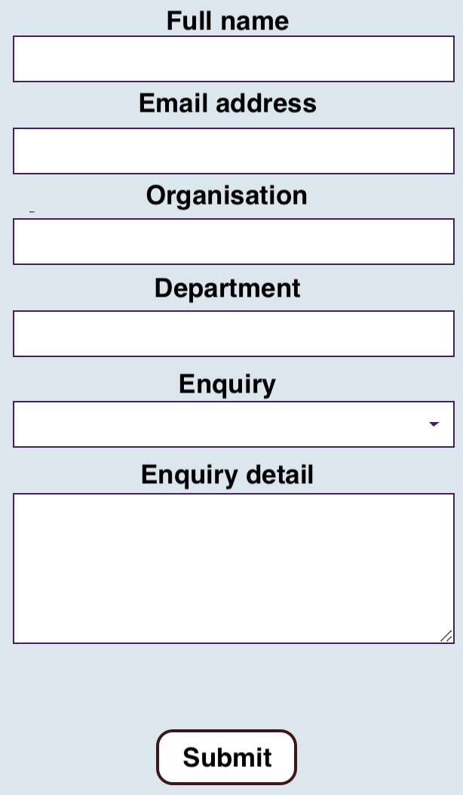

Making  a call withcurl  to fill a form

```
curl -v -u "username_http_auth:password_http_auth" -X POST -H "Accept: application/json" -H "Content-type: application/json"  -d \
'{
"webform_id":"contact",
"your_namename":"test",
"your_email":"test@test.com",
"your_organisation":"test",
"your_department":"test",
"your_enquiry":"test-enquiry",
"your_establishment":null,
"your_message":"test"
}' \
"https://example.com/web-form/submit?_format=json"
```


The visual web-form which used to be filled with  curl above

